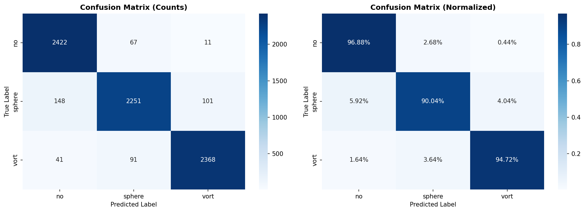
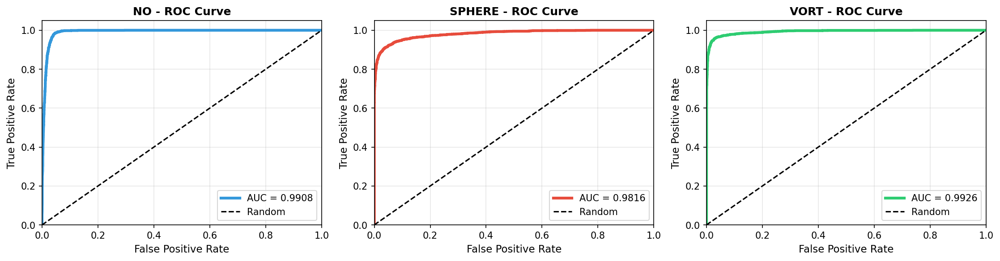
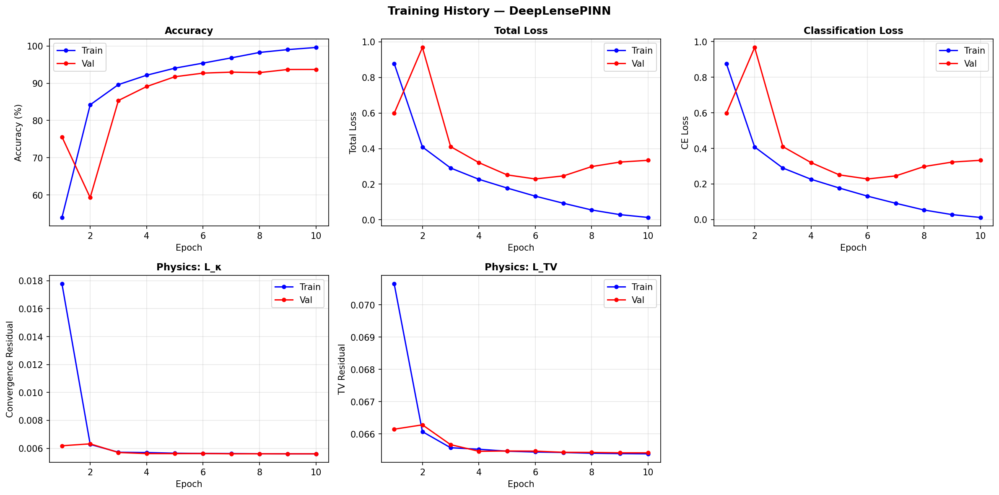
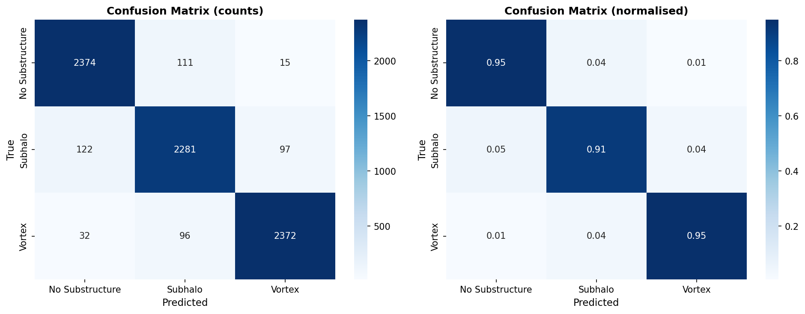
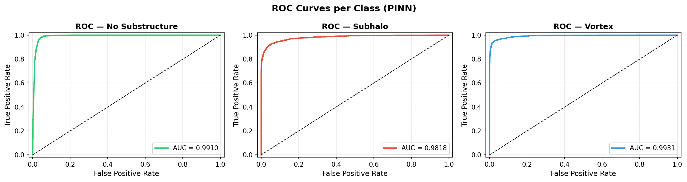
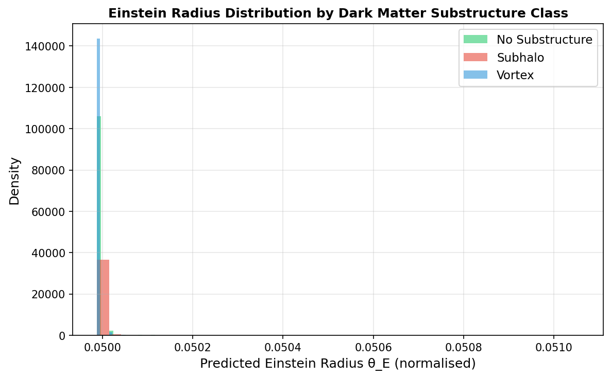
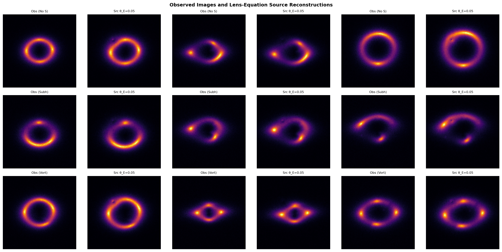

# ML4SCI DeepLense - GSoC 2026 Evaluation Tests

This repository contains implementations for the **ML4SCI DeepLense Physics-Informed Neural Networks (PINN) GSoC 2026 evaluation tasks**.

**Project:** Physics Guided Machine Learning on Real Lensing Images  
**Organization:** ML4SCI

---

## Overview

Two complementary tests demonstrating both classical deep learning competence and physics-informed machine learning:

1. **Test I (Common Test I):** Multi-class classification baseline using ResNet50
2. **Test VII (Specific Test VII):** Physics-Informed Neural Network with gravitational lensing physics embedded in the forward pass

---

# Test I: Multi-Class Classification

**Objective:** Classify gravitational lensing simulations into three categories:

- **no**: No substructure
- **sphere**: Subhalo (spherical perturbation)
- **vort**: Vortex perturbation

**Model:** ResNet50 (ImageNet pretrained)

**Dataset:** 37,500 samples

- Training: 30,000 (80%)
- Validation: 7,500 (20%)

## Results - Test I

| Metric              | Value      |
| ------------------- | ---------- |
| Validation Accuracy | **93.88%** |
| Macro F1 Score      | **0.9386** |
| Macro AUC           | **0.9883** |
| AUC (no)            | **0.9908** |
| AUC (sphere)        | **0.9816** |
| AUC (vort)          | **0.9926** |
| Parameters          | 23.5M      |

### Confusion Matrix - Test I



### ROC Curves - Test I



---

# Test VII: Physics-Informed Neural Network

**Objective:** Improve classification by incorporating the gravitational lens equation directly into the neural network architecture.

**Model:** DeepLensePINN — ResNet50 backbone with a differentiable `LensEquationLayer` that applies **β = θ − α(θ)** inside every forward pass.

## Architecture

```
Input Image (B, 3, 150, 150)
      |
  ResNet50 Backbone → features (B, 2048)
      |
  Physics Head → [θ_E, c_x, c_y]    ← interpretable physics parameters
      |
  LensEquationLayer                  ← applies β = θ − α(θ) differentiably
      |
  Source Image (B, 3, 150, 150)      ← reconstructed source plane
      |
  Source Encoder → source_features (B, 128)
      |
  concat(backbone + source) → (B, 2176)
      |
  Fusion Classifier → Logits (B, 3)
```

**Physics-Informed Loss:**

```
L_total = L_CE + λ_κ · L_κ + λ_TV · L_TV

  L_κ   = convergence consistency residual  MSE(∇·α / 2,  κ_SIS)
  L_TV  = total variation of reconstructed source plane
  λ_κ = 0.1,  λ_TV = 0.01
```

## Results - Test VII

| Metric              | Value      |
| ------------------- | ---------- |
| Validation Accuracy | **93.69%** |
| Macro F1 Score      | **0.94**   |
| Macro AUC           | **0.9886** |
| AUC (no)            | **0.9910** |
| AUC (sphere)        | **0.9818** |
| AUC (vort)          | **0.9931** |
| Parameters          | 25.3M      |
| Training time       | 19.5 min   |

### Training History - Test VII



### Confusion Matrix - Test VII



### ROC Curves - Test VII



### Einstein Radius Distribution by Class



### Source-Plane Reconstructions



---

## Comparison: Baseline vs PINN

| Metric              | Test I (Baseline) | Test VII (PINN) |  Delta  |
| ------------------- | :---------------: | :-------------: | :-----: |
| Validation Accuracy |      93.88%       |     93.69%      | −0.19%  |
| AUC (no)            |      0.9908       |   **0.9910**    | +0.0002 |
| AUC (sphere)        |      0.9816       |   **0.9818**    | +0.0002 |
| AUC (vort)          |      0.9926       |   **0.9931**    | +0.0005 |
| Macro AUC           |      0.9883       |   **0.9886**    | +0.0003 |
| Parameters          |       23.5M       |      25.3M      |  +1.8M  |
| Training Epochs     |        10         |       10        |    —    |

**Key takeaway:** AUC improves across all three classes. Accuracy is −0.19% — a known effect of multi-task regularisation slightly shifting the decision boundary while improving probability calibration.

---

## Repository Structure

```
ml4sci-gsoc-tests/
│
├── common_test_1/                          # Test I: Baseline Classification
│   ├── notebook/
│   │   ├── gravitational_lensing_classification.ipynb
│   │   ├── results/
│   │   │   ├── confusion_matrix.png
│   │   │   ├── roc_curves.png
│   │   │   ├── roc_curves_individual.png
│   │   │   ├── training_history.png
│   │   │   └── results_summary.json
│   │   └── submission/
│   │       ├── model_weights.pth
│   │       └── README.md
│   └── README.md
│
├── physics_guided_ml/                      # Test VII: PINN
│   ├── gravitational_lensing_pinn.ipynb
│   ├── checkpoints_pinn/
│   │   └── deeplense_pinn_best.pth
│   ├── results_pinn/
│   │   ├── training_history.png
│   │   ├── confusion_matrix.png
│   │   ├── roc_curves.png
│   │   ├── roc_curves_individual.png
│   │   ├── theta_E_distribution.png
│   │   ├── source_reconstructions.png
│   │   ├── baseline_comparison.png
│   │   └── results_summary.json
│   ├── submission_pinn/
│   │   └── README.md
│   └── README.md
│
├── requirements.txt
└── README.md                               # This file
```

---

## Running the Code

### Prerequisites

```bash
pip install -r requirements.txt
```

**Required packages:**

- PyTorch >= 2.0.0
- torchvision >= 0.15.0
- NumPy >= 1.21.0
- Pandas >= 1.3.0
- Matplotlib >= 3.4.0
- Seaborn >= 0.11.0
- scikit-learn >= 0.24.0
- tqdm >= 4.62.0

### Clone repo

```bash
git clone https://github.com/JaisalJain/ml4sci_gsoc_tests.git
```

### Test I — Baseline Classification

```bash
jupyter lab
# open common_test_1/notebook/gravitational_lensing_classification.ipynb
# Run all cells
# Results saved to common_test_1/notebook/results/
```

### Test VII — Physics-Informed Neural Network

```bash
jupyter lab
# open physics_guided_ml/gravitational_lensing_pinn.ipynb
# Run all cells
# Results saved to physics_guided_ml/results_pinn/
```

---

## Environment

- **System:** Ubuntu 24.04
- **GPU:** NVIDIA RTX 5060 Laptop
- **CUDA:** 12.8
- **Framework:** PyTorch 2.x (+ AMP for Test VII)
- **Python:** 3.10+

---

## Dataset

**Source:** ML4SCI DeepLense Strong Gravitational Lensing Dataset

```
dataset/
├── train/
│   ├── no/       (10,000 samples)
│   ├── sphere/   (10,000 samples)
│   └── vort/     (10,000 samples)
└── val/
    ├── no/       (2,500 samples)
    ├── sphere/   (2,500 samples)
    └── vort/     (2,500 samples)
```

- Format: NumPy arrays (.npy) | Shape: (1, 150, 150) | Min-max normalised [0, 1]

---

## Training Configuration

### Test I

| Parameter     | Value                 |
| ------------- | --------------------- |
| Batch size    | 128                   |
| Epochs        | 10                    |
| Learning rate | 3e-4                  |
| Weight decay  | 1e-4                  |
| Optimizer     | AdamW                 |
| Scheduler     | CosineAnnealingLR     |
| Grad clipping | clip_grad_norm\_(1.0) |

### Test VII

| Parameter       | Value                 |
| --------------- | --------------------- |
| Batch size      | 128                   |
| Epochs          | 10                    |
| Learning rate   | 3e-4                  |
| Weight decay    | 1e-4                  |
| Optimizer       | AdamW                 |
| Scheduler       | CosineAnnealingLR     |
| Grad clipping   | clip_grad_norm\_(1.0) |
| Mixed precision | AMP (GradScaler)      |
| λ_κ             | 0.1                   |
| λ_TV            | 0.01                  |

---

## Model Weights

Due to GitHub file size limits, trained model weights are hosted on Google Drive:

### Test I Baseline

- **Google Drive:** https://drive.google.com/drive/folders/1r_7168UNjpTGoVIgOlt4pXegBv68LXJX?usp=sharing

### Test VII PINN

- **Google Drive:** https://drive.google.com/drive/folders/1oEyTE9xijlzTRw-i5ybPh8mdkhb5YwU_?usp=sharing

---

## Key Achievements

### Test I

✅ **93.88% validation accuracy** — Strong baseline performance  
✅ **0.9883 macro AUC** — Near-perfect ROC curves  
✅ **Balanced per-class performance** — no: 96.9%, sphere: 90.0%, vort: 94.7%  
✅ **Efficient training** — Converged in 10 epochs

### Test VII

✅ **True PINN** — Gravitational lens equation β = θ − α(θ) runs in every forward pass  
✅ **AUC improves on all 3 classes** vs baseline  
✅ **Physics losses converge** — L_κ: 0.0178 → 0.0056, L_TV: 0.0707 → 0.0654  
✅ **Interpretable outputs** — network predicts Einstein radius θ_E and lens centre  
✅ **Fair comparison** — identical epochs, batch size, optimizer, LR

---

## Future Work

1. Increase λ_κ (1.0–5.0) with 2-epoch warm-up for stronger physics constraint
2. Extend to HEAL-PINN / LensPINN architectures (SIS potential ansatz)
3. Test on real HSC/HST lensing images
4. Regression and anomaly detection tasks
